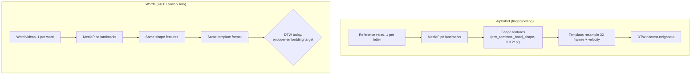
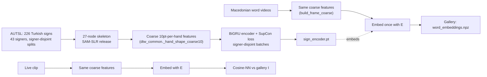

# MK_Sign — Macedonian Sign Language Recognizer

Status snapshot as of 2026-07-01. This documents what's built, *why* it's
built this way, and what's actually been measured so far (no projected or
made-up numbers — only results that were actually run).

## The constraint that shapes everything

- Only **one reference video per class** exists for both the alphabet and
  the word vocabulary (~2400 words). No re-recording is possible.
- Many alphabet letters are two-handed and involve motion, not static
  handshapes.
- Only **one signer** exists in the Macedonian data — no second-signer
  footage to validate cross-signer generalization against, for words or
  letters. This is a real, currently-unresolved risk (see Limitations).

→ One video per class rules out training a classifier per class. Everything
here is **few-shot / template matching**, not supervised classification of
Macedonian signs.

## Two subsystems

Both subsystems share the exact same feature/template code
(`alphabet/dtw_common.py`) — the only thing that differs is the final
distance metric used for word-scale cross-signer matching.

## Why shape features, not raw coordinates

`_hand_shape()` in `alphabet/dtw_common.py` encodes each hand as:
joint angles (finger curl), inter-finger spread angles, and normalized
fingertip distances — **not raw (x, y) landmark positions.**

This makes the descriptor scale-, translation-, and rotation-invariant, and
— because it's built from unsigned angles/distances — identical for a
mirrored hand shape. That buys partial signer-invariance for free, before
any learning happens.

## Alphabet system (`alphabet/`)

- `extract_templates.py` — builds templates from the reference videos.
- `record_templates.py` — records your own webcam takes (auto: raise hand →
  record, hand out → save).
- `sequence_demo.py` — the live demo: record a clip, split it into letters
  using hand-OUT gaps as the delimiter (pause-splitting is deliberately OFF
  — fingerspelling holds the wrist still *within* a letter, so pause
  detection would shred single letters into fragments).
- `dtw_common.classify()` — DTW nearest-neighbour against all templates for
  a letter, using a Sakoe-Chiba banded DTW distance.

**What was actually measured:** matching a live take against the
*reference signer's own single video* fails on her webcam — all
predictions collapse into one generic cluster, margins ≈ 1.0 (domain gap).
Matching against **her own recorded takes** works well. Conclusion: the
pipeline and features are correct; the system is currently
**signer-dependent**. This is the direct motivation for the encoder work.

## Words — Stage 0: does the representation survive at word scale?

`words/extract_word_templates.py` batch-extracts templates for all word
videos (MediaPipe pass cached to `data/landmarks/word_templates.npz`, 4
trim variants per video). `words/eval_dtw_baseline.py` then measures a
**self-retrieval upper bound**: query = one trim of a video, gallery = a
*different* trim of the *same* video. This can't measure cross-signer
accuracy (no second signer exists) — it only checks whether the features +
DTW stay discriminative once there are thousands of classes instead of ~30
letters.

**Measured (40-word smoke test):** top-1 **95%**, top-5 **97.5%**. The one
miss was a long sentence clip, not a single word. Verdict: the pipeline
survives word-length sequences — the only remaining problem is
cross-signer generalization, which self-retrieval can't test by
construction.

## Words — Stage 1: the encoder (solving cross-signer)

DTW alone can't learn "ignore who's performing this sign" — there's only
one Macedonian video per word, nothing to contrast against. The fix:
**train the invariance on a public multi-signer corpus, then transfer only
the invariance, not the vocabulary** (the FaceNet recipe: train an embedder
for signer-invariance, enroll new classes with a single example).

Key design point: AUTSL vocabulary (Turkish signs) is **discarded
entirely** — only the *invariance* the encoder learned (same sign,
different signer → same neighborhood) transfers, since that's
language-agnostic at the motion level.

**Why the "coarse" feature detour exists:** the publicly released AUTSL
skeleton data (SAM-SLR / `jackyjsy/CVPR21Chal-SLR`) isn't the raw 133
mmpose wholebody points — it's already reduced to a 27-node graph (7 body
points + 10 points per hand: root + base/tip per finger, thumb tip only).
That's fewer points than the 21 MediaPipe gives per hand, so the encoder
can only ever be trained on a **coarser** hand descriptor
(`_hand_shape_coarse10`, 20-dim per hand: 4 curl-proxy angles + 4 spreads +
12 distances) than the alphabet system's full descriptor. The Macedonian
side must go through the *same* coarse descriptor
(`COARSE10_FROM_MP21` selects the matching 10 of 21 MediaPipe points) so
both sides land in one shared embedding space.

**Measured (this training run, 2026-07-01):**

| Epoch | Loss  | Held-out-signer top-1 (226-way) |
|-------|-------|----------------------------------|
| 1     | —     | 42.1%                            |
| 39 (final) | 1.112 | 66.2%                       |

Held-out means: signers the model never saw during training. Random chance
on 226 classes is ~0.4%, so 66.2% is a strong signal that real
signer-invariant structure was learned, not just memorization — this
validates the riskiest assumption in the whole plan before a single
Macedonian word was touched. (Loss plateauing near 1.1 while accuracy kept
climbing is normal for this contrastive loss — the loss value itself is a
weak signal for this training objective; held-out accuracy is the one that
matters.)

Trained encoder saved at `models/sign_encoder.pt`.

## Where things stand right now (in progress)

Running `words/extract_word_templates_coarse.py` — re-extracts all ~2400
word videos through the coarse descriptor (checkpointed every 50 videos,
resumable) to produce `data/landmarks/word_templates_coarse.npz`. Next
after that finishes:

1. `build_macedonian_gallery()` in `notebooks/encoder_training.py` — embeds
   every word template with `sign_encoder.pt` → `word_embeddings.npz`.
2. `predict()` — cosine-nearest-neighbour lookup against that gallery,
   replacing DTW for the word-recognition path.
3. The real test still ahead: there is **no second Macedonian signer** to
   validate cross-signer accuracy on the actual target language. The
   held-out-signer number above is on Turkish/AUTSL only — it's the best
   available evidence the approach transfers, not proof it does for
   Macedonian specifically.

## Limitations / open risks

- **No cross-signer validation exists for Macedonian itself** — only one
  signer's footage exists for both letters and words. The encoder's 66.2%
  is measured on AUTSL signers, and is a proxy, not a guarantee.
- The coarse 10-point hand descriptor is strictly less expressive than the
  full 21-point one the alphabet system uses (no per-knuckle angles,
  thumb has no base point) — a deliberate trade to match AUTSL's available
  data, not a free upgrade.
- The alphabet (letter) system remains fully DTW-based and
  signer-dependent; the encoder work so far only targets the word-level
  system.
